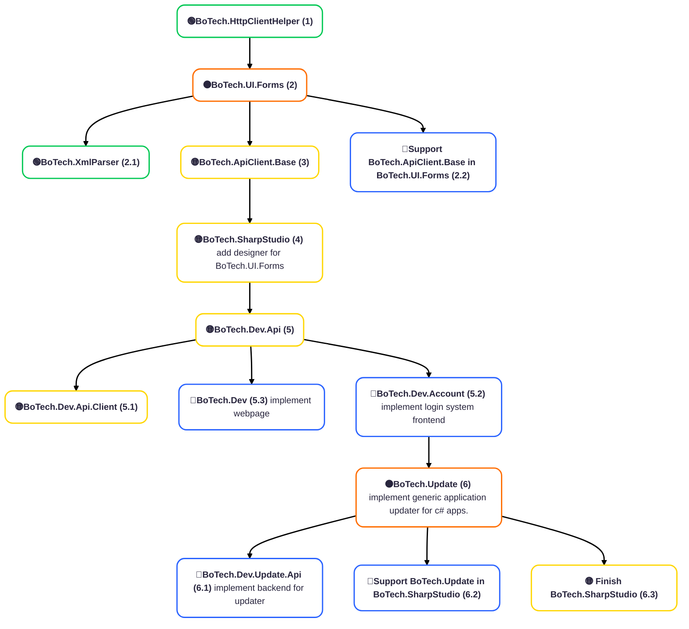
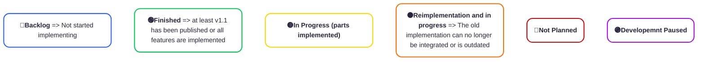

## Hi there 👋

## 🛤️ Roadmap for 12.2025-12.2026

## Chart Legend

### About me
+ I am currently in my second semester studying Applied Computer Science at the University of Duisburg-Essen.
+ When I have time, I work on various (see diagram) projects in my free time.
+ I currently work as a software developer (working student) at Benteler Steel/Tube

### Get in Contact
+ Mail: [support@botech.dev](mailto:support@botech.dev)
+ Or just open a ticket (issue) in one of the repos

